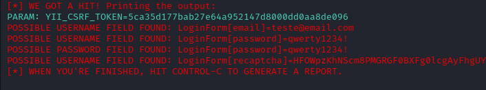

# Desafio de Projeto - Formação Cybersecurity Specialist

## Criação de um Phishing com o Kali Linux

O desafio proposto consistiu em utilizar a ferramenta setoolkit em um ambiente virtual do Kali Linux para a criação de um phishing, clonando algum site para coletar informações, como usuário e senha de uma possível vítima.

### Ferramentas

- Virtual Box
- Kali Linux
- setoolkit

### Configurando o Phishing no Kali Linux

- Limpando a porta 80: `sudo lsof -t -i tcp:80 -s tcp:listen | sudo xargs kill`
- Acesso root: `sudo su`
- Iniciando o setoolkit: `setoolkit`
- Tipo de ataque: `Social-Engineering Attacks`
- Vetor de ataque: `Web Site Attack Vectors`
- Método de ataque: `Credential Harvester Attack Method `
- Método de ataque: `Site Cloner`
- Obtendo o endereço da máquina: `ifconfig`
- URL para clone: http://secure.dafiti.com.br/customer/account/login/

### Resutados

Ao abrir o site clonado no navegador, inseri o email fictício `teste@email.com` e a senha `qwerty1234!`, e conforme consta no resultado, esses dados foram obtidos através do método.
